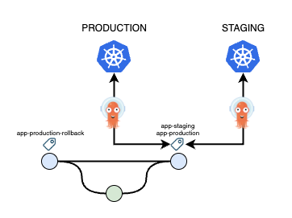
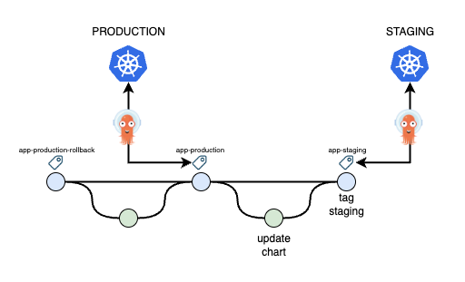
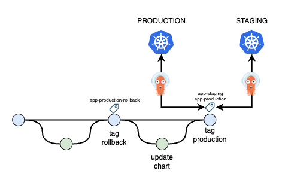
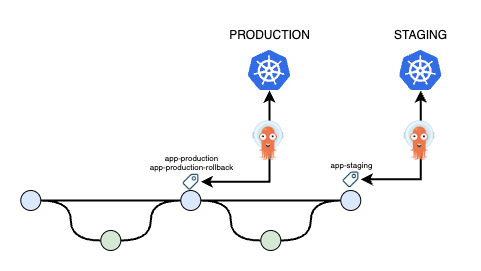

# gitops-tag-flow

This project demos GitHub action workflows for a tag-based GitOps strategy as described in the [ArgoCD docs](https://argo-cd.readthedocs.io/en/stable/user-guide/tracking_strategies/#tag-tracking)

## Tag Tracking

In a tag-based strategy, ArgoCD controls deployments based on tags in a given repo. As an example, you can create a tag in a repo e.g. `app/staging` and configure ArgoCD in the staging environment to watch that repo and specifically that tag. Likewise, you could configure production to watch a tag named `app/production`. When a service is updated, you simply move the tag to point at the new revision and ArgoCD will sync the application as needed.

## Workflows

### update-chart

This workflow updates a given service helm chart with the latest appVersion and opens a PR with the changes. This could be triggered by a workflow in the application code repo and takes the new app version as an input.

### deploy

This runs when the update-chart PR is merged. It simply "moves" the service staging tag to point at the revision of the merged PR. ArgoCD will see the tag revision changed and handle the deployment to staging. Additionally, this creates a tag in the repo with the new chart version for the given service e.g. app/1.2.3. This allows for rolling back to a specific chart version.

### promote

This workflow promotes a given service from staging to prod. As with the deploy workflow, it simply "moves" the service production tag to point at the same revision as the staging tag and ArgoCD handles the deployment. As an additional step, before moving the production tag it tags the revision it currently points at with a rollback tag. This allows for easy rollback as we can use this tag to know which revision we need to rollback to.

### rollback

This workflow can be triggered manually in the event we need to rollback a production release. As with the deploy & promote workflows, it simply moves the production tag but in this case it'll set the tag to point at the revision where the rollback tag is set or alternatively, if a specific chart version is provided, it'll rollback to that revision.

## Detailed Example

### Initial State

Here is what the initial state may look like before we update our app:

ArgoCD in staging is watching the `app/staging` tag and ArgoCD in production is watching the `app/production` tag. Both tags point to the same git revision and each ArgoCD deployment has synced the chart at that revision to its cluster.

### Staging Deployment

We update the application code in the application code repo and a GitHub workflow in that repo bumps the app version, builds & pushes a new docker image and then executes the `update-chart` workflow in this repo, passing the new app version as an input.

The `update-chart` workflow updates the helm chart with the new app version and opens a PR with the changes.

The PR is merged and the `deploy` workflow "moves" the staging tag to the new revision:

The staging ArgoCD sees the tag move and re-syncs the cluster with the chart at the new revision.

### Promote to Production

Once the changes have been verified in staging you can run the `promote` workflow. This will "move" the `app/production` tag to the same revision as staging i.e. the new version of the chart that was deployed to staging will get deployed to production:

Notice the rollback tag is also moved along which makes rolling back a single version super easy.

### Rollback

Triggering the `rollback` workflow will result in the production tag being moved back to where the rollback tag was left e.g:

Alternatively, if a specific chart version is specified it'll rollback to that version.

## Pros & Cons

### Pros

- tags are simple
- tags are easy to manipulate e.g. in an emergency you can easily set a tag to any revision to deploy that version
- doesn't require updates to ArgoCD application manifests
- deploy to staging could be fully automated if desired i.e. auto merge the PR or skip the PR step altogether
- no need for PR for promotion to prod
- fast & easy rollback
- simple repo/chart structure - can support many services & environments on a single branch without any duplication of the charts

### Cons

- although git is still the source of truth, the latest revision on main/master is not however the tags provide an easy way to see what's deployed where
- many services / environments in a single repo would mean many tags
- many people are more familiar with branch based flows vs tag based flows
